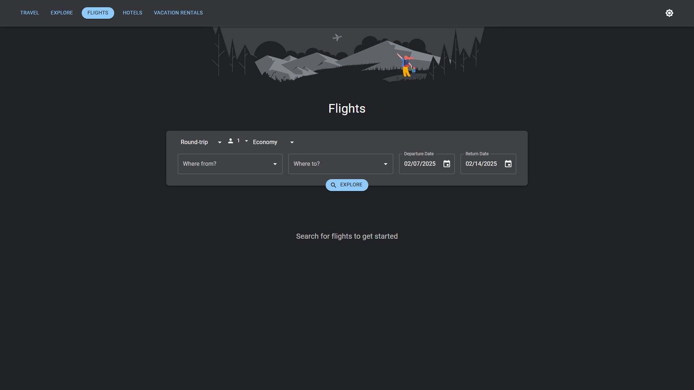
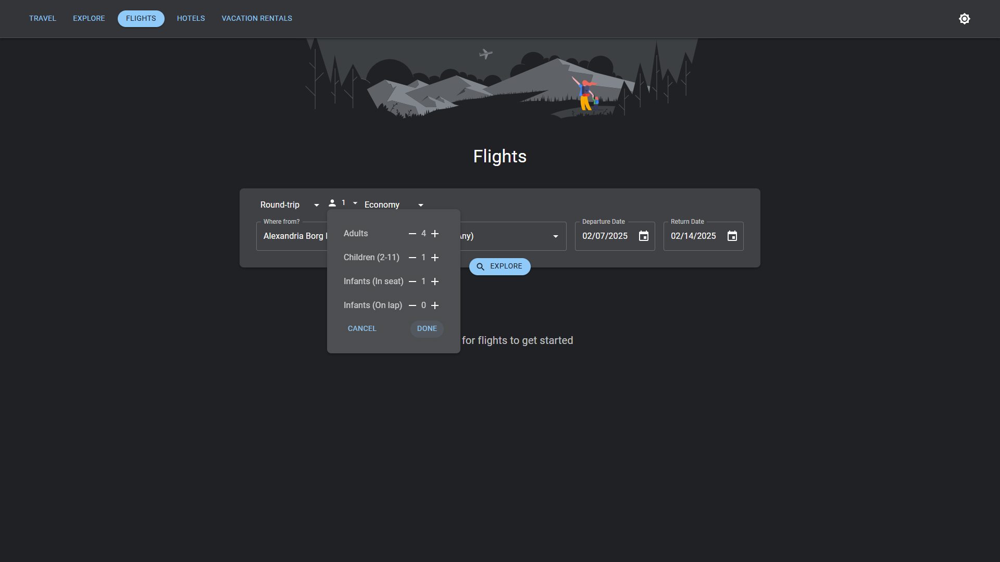
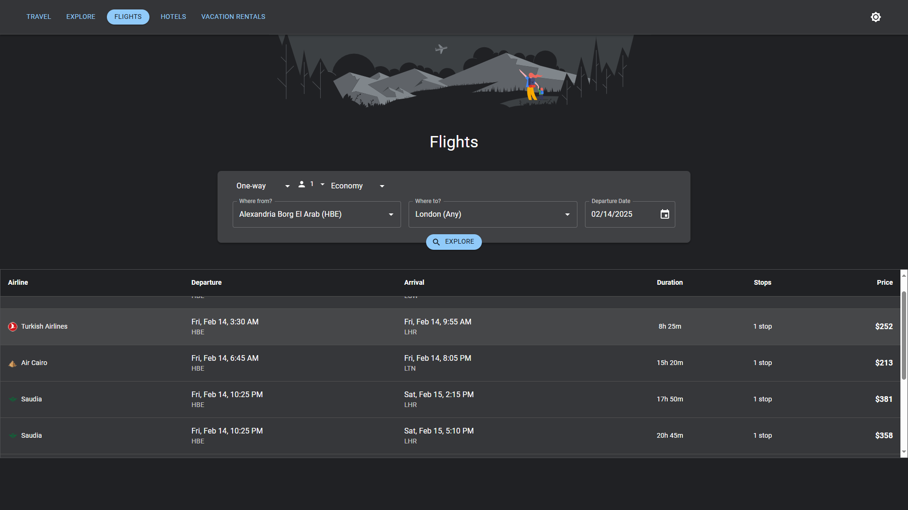
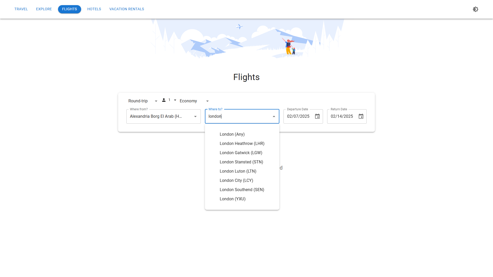
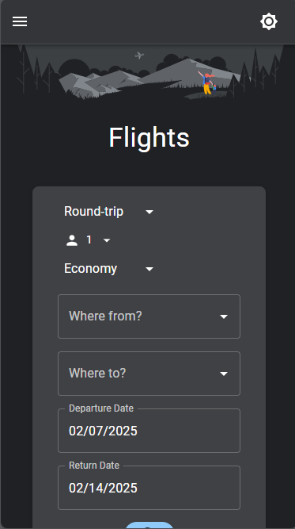
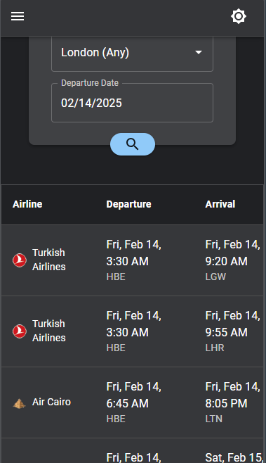

# Flight Search App

A React-based flight search application that allows users to search for flights, view flight details, and manage search parameters.


## Features

- **Flight Search**: Search for flights by origin, destination, date, and cabin class.
- **Airport Autocomplete**: Real-time airport suggestions as you type.
- **Passenger Selection**: Select the number of adults, children, and infants.
- **Date Selection**: Choose departure and return dates with a user-friendly date picker.
- **Cabin Class Selection**: Choose between Economy, Premium Economy, Business, and First Class.
- **Theme Toggle**: Switch between light and dark themes.
- **Responsive Design**: Optimized for both mobile and desktop views.

## Technologies Used

- **React**: A JavaScript library for building user interfaces.
- **Material-UI**: A popular React UI framework.
- **RapidAPI**: For fetching flight and airport data.

## Usage

1. **Enter Origin & Destination**: Select the origin and destination airports.
2. **Choose Dates**: Select the departure and return dates.
3. **Select Passengers**: Choose the number of passengers and cabin class.
4. **View Flights**: Click "Search" to view flight results.

## Screenshots

### Web Version





### Mobile Version




## Project Structure

```
├── api/
│   ├── airportApi.js
│   ├── configApi.js
│   └── flightApi.js
├── components/
│   ├── common/
│   │   ├── LoadingSpinner.js
│   │   └── ThemeToggle.js
│   └── flight/
│       ├── AirportAutocomplete.js
│       ├── CabinClassSelector.js
│       ├── DateSelector.js
│       ├── FlightResults.js
│       ├── FlightSearch.js
│       ├── FlightSearchForm.js
│       ├── Navbar.js
│       ├── PassengerSelector.js
│       ├── SearchButton.js
│       └── TripSelector.js
├── contexts/
│   ├── FlightSearchContext.js
│   └── ThemeContext.js
├── hooks/
│   ├── useAirports.js
│   └── useFlightSearch.js
├── theme/
│   ├── constants.js
│   └── theme.js
├── utils/
│   ├── dateUtils.js
│   └── formatters.js
├── App.js
├── index.css
└── index.js
```

## Components

### API

- `airportApi.js` - Handles airport-related API calls
- `configApi.js` - Handle Air Scrapper configuration API calls
- `flightApi.js` - Handles flight search and related API calls

### Common Components

- `LoadingSpinner.js` - Loading state indicator
- `ThemeToggle.js` - Theme switching functionality

### Flight Components

- `AirportAutocomplete.js` - Airport search and selection
- `CabinClassSelector.js` - Cabin class selection
- `DateSelector.js` - Flight date selection
- `FlightResults.js` - Display flight search results
- `FlightSearch.js` - Main flight search component
- `FlightSearchForm.js` - Flight search form
- `Navbar.js` - Navigation component
- `PassengerSelector.js` - Passenger count and type selection
- `SearchButton.js` - Search action button
- `TripSelector.js` - Trip type selection (one-way/round-trip/multi-city)

### Contexts

- `FlightSearchContext.js` - Flight search state management
- `ThemeContext.js` - Theme state management

### Hooks

- `useAirports.js` - Custom hook for airport data
- `useFlightSearch.js` - Custom hook for flight search functionality

### Theme

- `constants.js` - Theme-related constants
- `theme.js` - Theme configuration

### Utils

- `dateUtils.js` - Date manipulation utilities
- `formatters.js` - Data formatting utilities

## Getting Started

1. Install dependencies:

```bash
npm install
```

2. Start the development server:

```bash
npm start
```

## Environment Variables

Create a `.env` file in the root directory with the following variables:

```
REACT_APP_RAPIDAPI_KEY=your_api_url
```

## 👨‍💻 Author

Developed by **Tarek Alnaggar** 🚀

---

Feel free to contribute and improve the project! 😊
